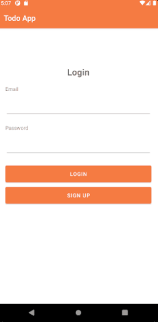
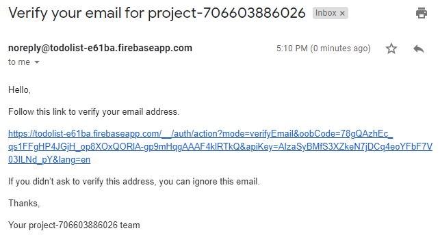
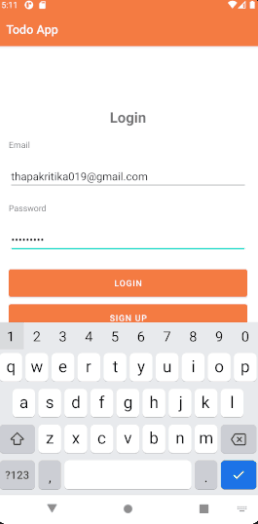
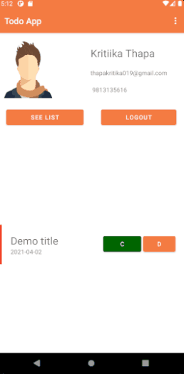
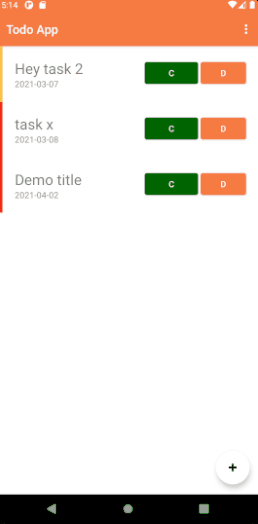
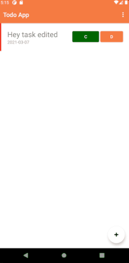
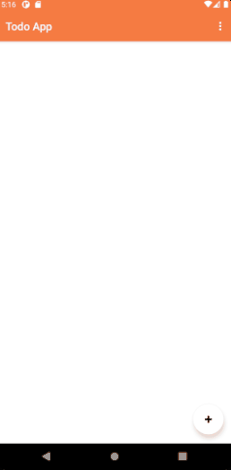

# Todo List App

This is a Todo Mobile Application that uses Firebase to authenticate and SQLite for recording the tasks given by the user. The application is made on Android Studio using the API 30. 

## Clone

Use the github [Link]() to clone the project file.

```bash
git clone 
```

## Using the Application

### Register on the application

To be able to use the application a user must register to the Google Firestore account of the application and the valid email must be passed to the application. For further login authentication, the user must provide the email, password, phone contact and Full name to submit the registration form in the application.



### Login on the application

The user can log in to the system using the same email address and the password that is used in the registration process, Now the email will be sent to the user to their mailing address that is provided on the registration.


Now when the user clicks on the link that is forwarded to their mailing address then the user will be verified to the system to use the application. The user will be forwarded the profile page which will show their top 2 tasks their information and their avatar





###  Creating a Task 
Any task could be created using the Floating Button on the List page of the application. The credential needed are Title , Description , Date , Priority and Completed checkbox



## Updating a task
Any task could be updated at any time by tapping to the list text column.


### Completing a Task

Tasks in the application can be marked as complete using the green C button in the list.

Also the completed task can be deleted using the "Delete Complete" button in the menu item.


### Delete a Task

Tasks can be deleted in the application using the orange D button in the list.


### Logout of the application

The user could logout form the system using the logout menu item in the menu bar



## Copyright
This application is copyrightted to Kritika Thapa.
